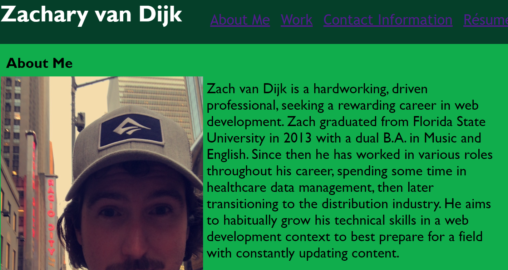

# portfolio-showcase
Digital Portfolio 

## Table of Contents
1. [Description](#description)
2. [Visuals](#visuals)
3. [License](#license)

## Description
[Link to live portfolio](https://zachattack221.github.io/portfolio-showcase/)

This repository showcases a digital portfolio, highlighting the web development work done in and outside UNCC's Full-Stack Flex Bootcamp program. It serves to provide a condensed, robust, and informative hub describing Zach van Dijk, his qualifications, contact info, and overall body of work.

## Visuals

## License
This application is licensed with the MIT License.